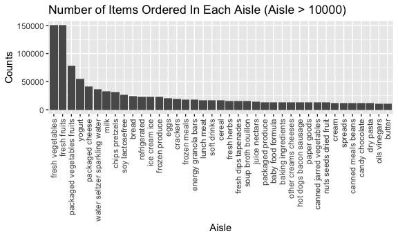

p8105\_hw3\_ac4964
================
AnMei Chen
10/13/2021

# Problem 1

``` r
library(tidyverse)
```

    ## ── Attaching packages ─────────────────────────────────────── tidyverse 1.3.1 ──

    ## ✓ ggplot2 3.3.5     ✓ purrr   0.3.4
    ## ✓ tibble  3.1.4     ✓ dplyr   1.0.7
    ## ✓ tidyr   1.1.3     ✓ stringr 1.4.0
    ## ✓ readr   2.0.1     ✓ forcats 0.5.1

    ## ── Conflicts ────────────────────────────────────────── tidyverse_conflicts() ──
    ## x dplyr::filter() masks stats::filter()
    ## x dplyr::lag()    masks stats::lag()

``` r
library(p8105.datasets)
library(reshape2)
```

    ## 
    ## Attaching package: 'reshape2'

    ## The following object is masked from 'package:tidyr':
    ## 
    ##     smiths

``` r
data("instacart")

knitr::opts_chunk$set(
  fig.width = 6,
  fig.asp = .6,
  out.width = "90%"
)

options(
  ggplot2.continuous.colour = "viridis" , 
  ggplot2.continuous.fill = "viridis"
)

scale_colour_discrete = scale_colour_viridis_d
scale_fill_discrete = scale_fill_viridis_d
```

The dataset of instacart contains data of 3421070 orders from instacart.
It contains a total of 1384617 observations and 15 variables (order\_id,
product\_id, add\_to\_cart\_order, reordered, user\_id, eval\_set,
order\_number, order\_dow, order\_hour\_of\_day,
days\_since\_prior\_order, product\_name, aisle\_id, department\_id,
aisle, department). An example of this dataset would be: 1, 49302, 1, 1,
112108, train, 4, 4, 10, 9, Bulgarian Yogurt, 120, 16, yogurt, dairy
eggs

How many aisles are there, and which aisles are the most items ordered
from?

``` r
n_of_aisles = 
  instacart %>% 
  pull(aisle) %>% 
  factor() %>% 
  nlevels()

most_freq_aisles = 
  instacart %>% 
  group_by(aisle) %>%
  summarize(counts = n()) %>%
  arrange(desc(counts)) %>% 
  head(1)
```

There are 134 aisles in this data set. The aisles that the most items
ordered from is the fresh vegetables aisle.

Make a plot that shows the number of items ordered in each aisle,
limiting this to aisles with more than 10000 items ordered. Arrange
aisles sensibly, and organize your plot so others can read it.

``` r
aisles_10000 =
  instacart %>% 
  group_by(aisle) %>%
  summarize(counts = n()) %>% 
  filter(counts > 10000) %>% 
  mutate(
    aisle = factor(aisle),
    aisle = forcats::fct_reorder(aisle, counts, desc)
  )
 
ggplot(aisles_10000) + 
geom_histogram(aes(x = aisle, y = counts), stat = "identity") +
labs(
    title = "Number of Items Ordered In Each Aisle (Aisle > 10000)",
    x = "Aisle",
    y = "Counts",
  ) +
theme(axis.text.x = element_text(angle = 90, vjust = 0.5, hjust = 1))
```

    ## Warning: Ignoring unknown parameters: binwidth, bins, pad



Make a table showing the three most popular items in each of the aisles
“baking ingredients”, “dog food care”, and “packaged vegetables fruits”.
Include the number of times each item is ordered in your table.

``` r
most_pop_of_bi =
  instacart %>%
  group_by(aisle,product_name) %>%
  filter(aisle == "baking ingredients" ) %>%
  summarize(counts = n()) %>% 
  arrange(desc(counts)) %>% 
  head(3)
```

    ## `summarise()` has grouped output by 'aisle'. You can override using the `.groups` argument.

``` r
most_pop_of_dfc =
  instacart %>% 
  group_by(aisle,product_name) %>%
  filter(aisle == "dog food care" ) %>%
  summarize(counts = n()) %>%
  arrange(desc(counts)) %>% 
  head(3)
```

    ## `summarise()` has grouped output by 'aisle'. You can override using the `.groups` argument.

``` r
most_pop_of_pvf =
  instacart %>% 
  group_by(aisle,product_name) %>%
  filter(aisle == "packaged vegetables fruits" ) %>%
  summarize(counts = n()) %>%
  arrange(desc(counts)) %>% 
  head(3)
```

    ## `summarise()` has grouped output by 'aisle'. You can override using the `.groups` argument.

``` r
most_pop_of_three = 
  bind_rows(most_pop_of_bi, most_pop_of_dfc,most_pop_of_pvf) %>%
  knitr::kable(digits = 2)

most_pop_of_three
```

| aisle                      | product\_name                                 | counts |
|:---------------------------|:----------------------------------------------|-------:|
| baking ingredients         | Light Brown Sugar                             |    499 |
| baking ingredients         | Pure Baking Soda                              |    387 |
| baking ingredients         | Cane Sugar                                    |    336 |
| dog food care              | Snack Sticks Chicken & Rice Recipe Dog Treats |     30 |
| dog food care              | Organix Chicken & Brown Rice Recipe           |     28 |
| dog food care              | Small Dog Biscuits                            |     26 |
| packaged vegetables fruits | Organic Baby Spinach                          |   9784 |
| packaged vegetables fruits | Organic Raspberries                           |   5546 |
| packaged vegetables fruits | Organic Blueberries                           |   4966 |

Make a table showing the mean hour of the day at which Pink Lady Apples
and Coffee Ice Cream are ordered on each day of the week; format this
table for human readers (i.e. produce a 2 x 7 table).

``` r
apples_icecream =
  instacart %>% 
  filter(product_name == "Pink Lady Apples" | product_name == "Coffee Ice Cream") %>%
  group_by(product_name,order_dow) %>% 
  mutate(
    order_dow = factor(order_dow),
    order_dow = recode(order_dow, "0" = "Sunday", "1" = "Monday", "2" = "Tuesday", "3" = "Wendesday", "4" = "Thursday", "5" = "Friday", "6" = "Saturday"),
    order_dow = ordered(order_dow, levels = c("Sunday", "Monday", "Tuesday", "Wendesday","Thursday","Friday","Saturday"))
    ) %>% 
  summarize(mean_hour = mean(order_hour_of_day)) %>% 
  pivot_wider(
    names_from = "order_dow",
    values_from = "mean_hour"
    ) %>% 
  knitr::kable()
```

    ## `summarise()` has grouped output by 'product_name'. You can override using the `.groups` argument.

# Problem 2

``` r
data("brfss_smart2010")

brfss_df = 
  brfss_smart2010 %>% 
  janitor::clean_names() %>% 
  filter(topic == "Overall Health") %>% 
  mutate(
    response = factor(response),
    response = ordered(response, levels = c("Poor", "Fair", "Good", "Very good", "Excellent")),
  ) %>% 
  rename( 
    state = locationabbr,
    county = locationdesc 
          )

levels(brfss_df$response)
```

    ## [1] "Poor"      "Fair"      "Good"      "Very good" "Excellent"

In 2002, which states were observed at 7 or more locations? What about
in 2010?

``` r
colnames(brfss_df)
```

    ##  [1] "year"                       "state"                     
    ##  [3] "county"                     "class"                     
    ##  [5] "topic"                      "question"                  
    ##  [7] "response"                   "sample_size"               
    ##  [9] "data_value"                 "confidence_limit_low"      
    ## [11] "confidence_limit_high"      "display_order"             
    ## [13] "data_value_unit"            "data_value_type"           
    ## [15] "data_value_footnote_symbol" "data_value_footnote"       
    ## [17] "data_source"                "class_id"                  
    ## [19] "topic_id"                   "location_id"               
    ## [21] "question_id"                "respid"                    
    ## [23] "geo_location"

``` r
location_2002 = 
  brfss_df %>%
  filter(year == "2002") %>% 
  group_by(state) %>%  
  distinct(county) %>%  
  count(state) %>% 
  filter(n >= 7) %>% 
  arrange(n)

location_2010 = 
  brfss_df %>%
  filter(year == "2010") %>% 
  group_by(state) %>%  
  distinct(county) %>%  
  count(state) %>% 
  filter(n >= 7) %>% 
  arrange(n)
```

Construct a dataset that is limited to Excellent responses, and
contains, year, state, and a variable that averages the data\_value
across locations within a state. Make a “spaghetti” plot of this average
value over time within a state (that is, make a plot showing a line for
each state across years – the geom\_line geometry and group aesthetic
will help).

``` r
excellent_dataset =
  brfss_df %>% 
  filter(response == "Excellent") %>%
  select(c(year,state, data_value)) %>% 
  group_by(year, state) %>% 
  summarise_at( vars(average = data_value), funs(mean(., na.rm = TRUE))) %>% 
  ggplot(aes(x = year, y = average, color = state)) +
  geom_line()  +
  labs(
    title = "Average Value Over Time Within Each State",
    x = "Year",
    y = "Average Value",
  )
```

    ## Warning: `funs()` was deprecated in dplyr 0.8.0.
    ## Please use a list of either functions or lambdas: 
    ## 
    ##   # Simple named list: 
    ##   list(mean = mean, median = median)
    ## 
    ##   # Auto named with `tibble::lst()`: 
    ##   tibble::lst(mean, median)
    ## 
    ##   # Using lambdas
    ##   list(~ mean(., trim = .2), ~ median(., na.rm = TRUE))
    ## This warning is displayed once every 8 hours.
    ## Call `lifecycle::last_warnings()` to see where this warning was generated.

Make a two-panel plot showing, for the years 2006, and 2010,
distribution of data\_value for responses (“Poor” to “Excellent”) among
locations in NY State.

``` r
distribution_plot =
  brfss_df %>% 
  filter(year == "2006" | year == "2010" , state == "NY") %>% 
  ggplot(aes(x = response, y = data_value)) +
  geom_boxplot() +
  facet_grid(. ~ year)
```

# Problem 3

``` r
accel_df = 
  read_csv("data/accel_data.csv") %>% 
  janitor::clean_names() %>% 
  mutate(
    weekday_vs_weekend = recode(day, "Monday" = "Weekday", "Tuesday" = "Weekday","Wednesday" = "Weekday","Thursday" = "Weekday", "Friday" = "Weekday","Saturday" = "Weekend","Sunday" = "Weekend")
    ) %>% 
  relocate(week,day_id,weekday_vs_weekend)
```

    ## Rows: 35 Columns: 1443

    ## ── Column specification ────────────────────────────────────────────────────────
    ## Delimiter: ","
    ## chr    (1): day
    ## dbl (1442): week, day_id, activity.1, activity.2, activity.3, activity.4, ac...

    ## 
    ## ℹ Use `spec()` to retrieve the full column specification for this data.
    ## ℹ Specify the column types or set `show_col_types = FALSE` to quiet this message.

The dataset of Accekerineters contains 35 days of accelerometer data
collected on a 63 year-old male with BMI 25, who was admitted to the
Advanced Cardiac Care Center of Columbia University Medical Center and
diagnosed with congestive heart failure. It contains a total of 35
observations and 1444 variables.

Traditional analyses of accelerometer data focus on the total activity
over the day. Using your tidied dataset, aggregate across minutes to
create a total activity variable for each day, and create a table
showing these totals. Are any trends apparent?

``` r
total_act =
  accel_df %>%
  mutate(total_activity = rowSums(across(activity_1:activity_1440))) %>%
  select(c(day_id,total_activity)) %>%
  knitr::kable() 

total_act_plot =
  accel_df %>%
  mutate(total_activity = rowSums(across(activity_1:activity_1440))) %>%
  select(c(day_id,total_activity)) %>%
  ggplot(aes(x = day_id, y = total_activity)) +
  geom_line()
```

Accelerometer data allows the inspection activity over the course of the
day. Make a single-panel plot that shows the 24-hour activity time
courses for each day and use color to indicate day of the week.

``` r
hr_act_time_plot = 
  accel_df %>%
  mutate(
    day = factor(day),
    day = ordered(day, levels = c("Sunday", "Monday", "Tuesday", "Wednesday", "Thursday", "Friday", "Saturday"))
  ) %>% 
  melt(id.vars = c("day_id","day")) %>% 
  ggplot(aes(x = as.integer(value), y = day_id, color = day)) +
  geom_line(alpha = .5) +
  scale_x_continuous(n.breaks = 10) +
  scale_y_continuous(n.breaks = 10) +
  labs(
    title = "24-Hour Activity Time Courses For Each Day",
    x = "Activity Counts For Each Minute",
    y = "Day",
  ) 
```

Describe in words any patterns or conclusions you can make based on this
graph.

Most of the days the 24-hour acticity counts for each minute of this
patient are ranging from 0 to 2500. Wednesday has the highest activity
counts for each minute in a 24-hour day.
